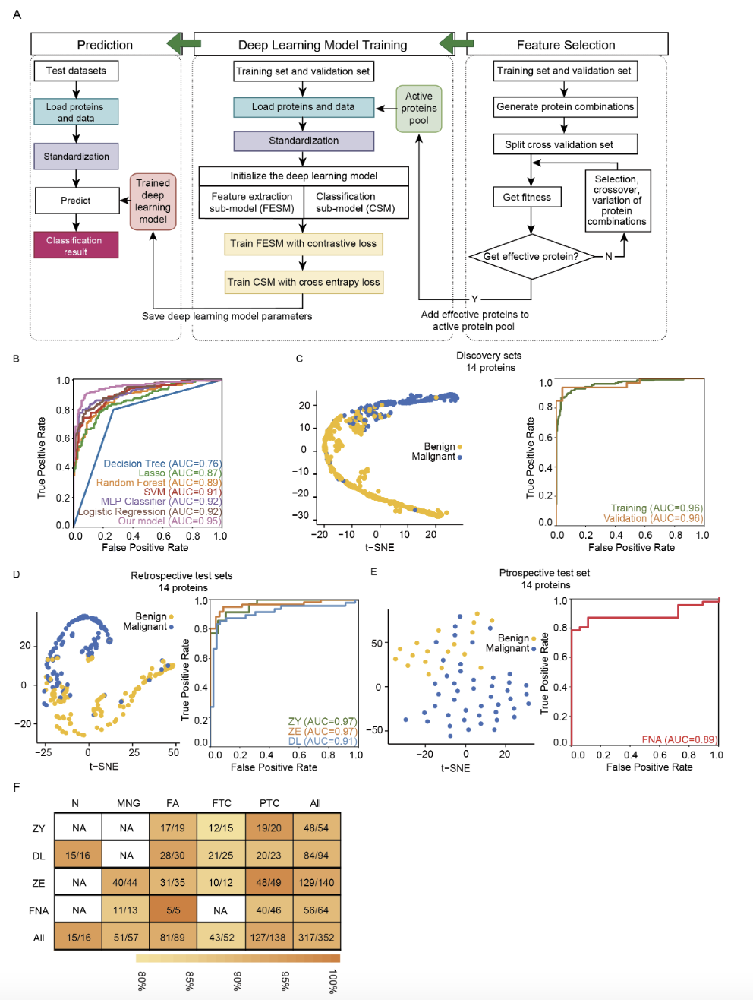

the output of the code is shwon in ./main.log

[](https://doi.org/10.21105/joss.01596) [](https://zenodo.org/badge/latestdoi/144551119) 
# Manidold leanrning based neural network model for thyroid-project

Implementation of the ivis algorithm as described in the paper [Protein classifier for thyroid nodules learned from rapidly acquired proteotypes (preprint)](https://www.medrxiv.org/content/medrxiv/early/2020/04/14/2020.04.09.20059741.full.pdf) and [Artificial intelligence defines protein-based classification of thyroid nodules](https://www.medrxiv.org/content/medrxiv/early/2020/04/14/2020.04.09.20059741.full.pdf).


Classifier development, performance testing and validation in independent blinded datasets.(A) Schematic of principal classifier model (details in Supplementary Methods). (B) ROC plots of seven different machine learning modelunder 14 selected features. (C) t-SNE plot showing the separation between benign malignant groups in the discovery set using 14 protein features with latent space; and ROC plots of the training and validation sample subgroups of the discovery set. (D-E) t-SNE and ROC plots of the performance for (D) retrospective test sets; and (E) prospective test set (total cohort and individual hospital sites as indicated). (F) Overall performance metrics of prediction of the neural network model for five specific histopathological types per site. Graduated colors in the shaded bar indicate accuracy levels. Numbers in the boxes indicate the number of correctly identified samples/total sample number


## Environment

OS: Linux-3.10.0-327.el7.x86_64-x86_64-with-glibc2.10
GPU type: NVIDIA GeForce RTX 2080 Ti

Our code runs on top of Pytorch. 

```
name: py38torch180
channels:
  - pytorch
  - defaults
dependencies:
  - _libgcc_mutex=0.1=main
  - backcall=0.2.0=pyhd3eb1b0_0
  - blas=1.0=mkl
  - bzip2=1.0.8=h7b6447c_0
  - ca-certificates=2021.5.25=h06a4308_1
  - certifi=2020.12.5=py38h06a4308_0
  - cudatoolkit=10.1.243=h6bb024c_0
  - ffmpeg=4.3=hf484d3e_0
  - freetype=2.10.4=h5ab3b9f_0
  - gmp=6.2.1=h2531618_2
  ....
```
Please check ./env.yaml for details.


## Running 

To reproduce our results, run:

```
python main.py --lr 0.002 --l2 0.05 --epochs 100 --alpha 1.6 --batch_size 128 --seed 1 --device cuda --verbose 0 --plot 1 --fillna 12.0 --stan_feature 0 --protein_list_input P02765 P04083 O00339 P58546 O75347 P04216 P02751 P83731 P00568 P78527 P04792 P57737 P42224 P27797 Q9HAT2 P30086 O14964 P10909 P17931 --use_wandb 1
```
The log of our run is shown in main.log

## Citation

If you need to cite our code, please pay attention to the following information:
```
@article {Sun2020.04.09.20059741,
	author = {Sun, Yaoting and Selvarajan, Sathiyamoorthy and Zang, Zelin and Liu, Wei and Zhu, Yi and Zhang, Hao and Chen, Hao and Cai, Xue and Gao, Huanhuan and Wu, Zhicheng and Chen, Lirong and Teng, Xiaodong and Zhao, Yongfu and Mantoo, Sangeeta and Lim, Tony Kiat-Hon and Hariraman, Bhuvaneswari and Yeow, Serene and bin Syed Abdillah, Syed Muhammad Fahmy and Lee, Sze Sing and Ruan, Guan and Zhang, Qiushi and Zhu, Tiansheng and Wang, Weibin and Wang, Guangzhi and Xiao, Junhong and He, Yi and Wang, Zhihong and Sun, Wei and Qin, Yuan and Xiao, Qi and Zheng, Xu and Wang, Linyan and Zheng, Xi and Xu, Kailun and Shao, Yingkuan and Liu, Kexin and Zheng, Shu and Aebersold, Ruedi and Li, Stan Z. and Kon, Oi Lian and Iyer, N. Gopalakrishna and Guo, Tiannan},
	title = {Protein Classifier for Thyroid Nodules Learned from Rapidly Acquired Proteotypes},
	elocation-id = {2020.04.09.20059741},
	year = {2020},
	doi = {10.1101/2020.04.09.20059741},
	publisher = {Cold Spring Harbor Laboratory Press},
	abstract = {Up to 30\% of thyroid nodules cannot be accurately classified as benign or malignant by cytopathology. Diagnostic accuracy can be improved by nucleic acid-based testing, yet a sizeable number of diagnostic thyroidectomies remains unavoidable. In order to develop a protein classifier for thyroid nodules, we analyzed the quantitative proteomes of 1,725 retrospective thyroid tissue samples from 578 patients using pressure-cycling technology and data-independent acquisition mass spectrometry. With artificial neural networks, a classifier of 14 proteins achieved over 93\% accuracy in classifying malignant thyroid nodules. This classifier was validated in retrospective samples of 271 patients (91\% accuracy), and prospective samples of 62 patients (88\% accuracy) from four independent centers. These rapidly acquired proteotypes and artificial neural networks supported the establishment of an effective protein classifier for classifying thyroid nodules.Competing Interest StatementThe research group of T.G. is supported by Pressure Biosciences Inc, which provides sample preparation instrumentation.Funding StatementThis work was supported by grants from National Natural Science Foundation of China (81972492) and National Natural Science Fund for Young Scholars (21904107), Zhejiang Provincial Natural Science Foundation for Distinguished Young Scholars (LR19C050001), Hangzhou Agriculture and Society Advancement Program (20190101A04). Further support for this project was obtained from the National Cancer Centre Research Fund (Peter Fu Program) and National Medical Research Council Clinician-Scientist Award (NMRC/CSAINV/011/2016), both in Singapore. The prospective study was supported by National Natural Science Foundation of China (81902726), China Postdoctoral Science Foundation (NO. 2018M641739), Natural Science Foundation of Liaoning Province (20180530090).Author DeclarationsAll relevant ethical guidelines have been followed; any necessary IRB and/or ethics committee approvals have been obtained and details of the IRB/oversight body are included in the manuscript.YesAll necessary patient/participant consent has been obtained and the appropriate institutional forms have been archived.YesI understand that all clinical trials and any other prospective interventional studies must be registered with an ICMJE-approved registry, such as ClinicalTrials.gov. I confirm that any such study reported in the manuscript has been registered and the trial registration ID is provided (note: if posting a prospective study registered retrospectively, please provide a statement in the trial ID field explaining why the study was not registered in advance).YesI have followed all appropriate research reporting guidelines and uploaded the relevant EQUATOR Network research reporting checklist(s) and other pertinent material as supplementary files, if applicable.YesAll data are available in the manuscript or the supplementary material. MS raw data were deposited in iProX (IPX000444000). All the data will be publicly released upon publication.},
	URL = {https://www.medrxiv.org/content/early/2020/04/16/2020.04.09.20059741},
	eprint = {https://www.medrxiv.org/content/early/2020/04/16/2020.04.09.20059741.full.pdf},
	journal = {medRxiv}
}
```

Copyright 2022 Bering Limited